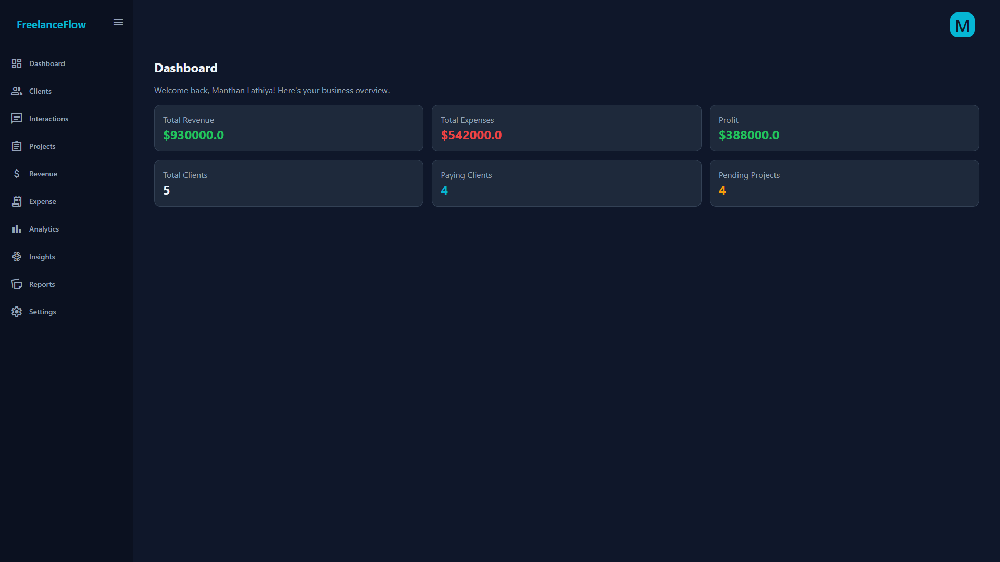
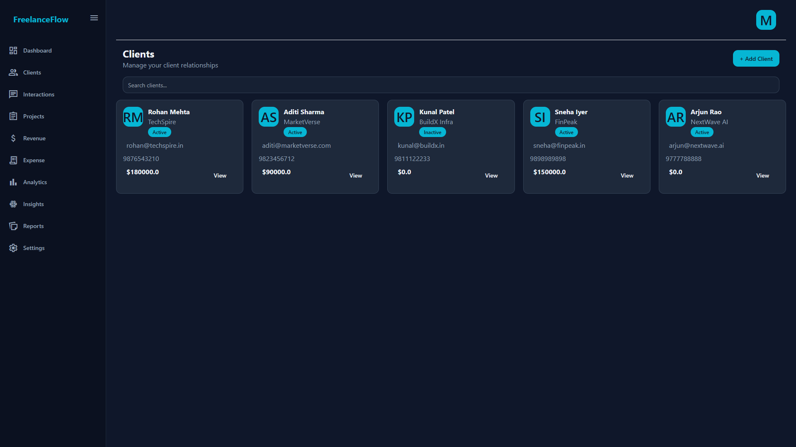
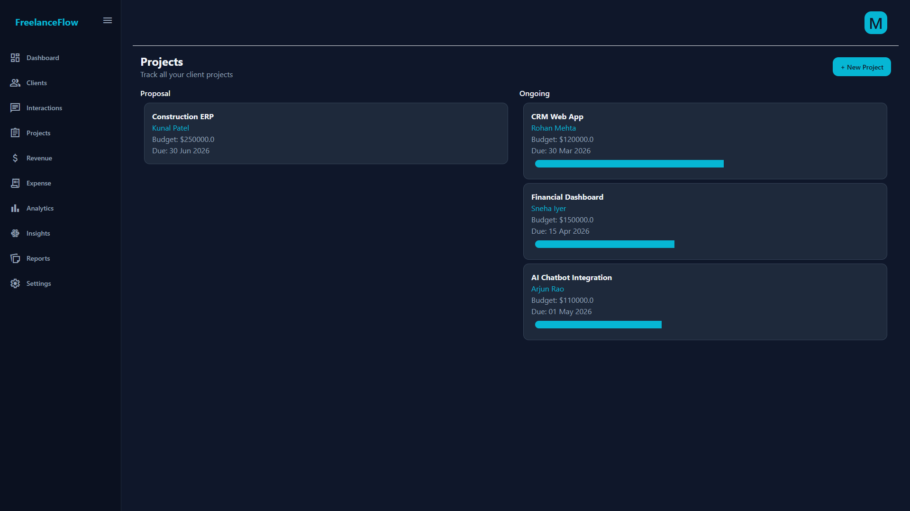
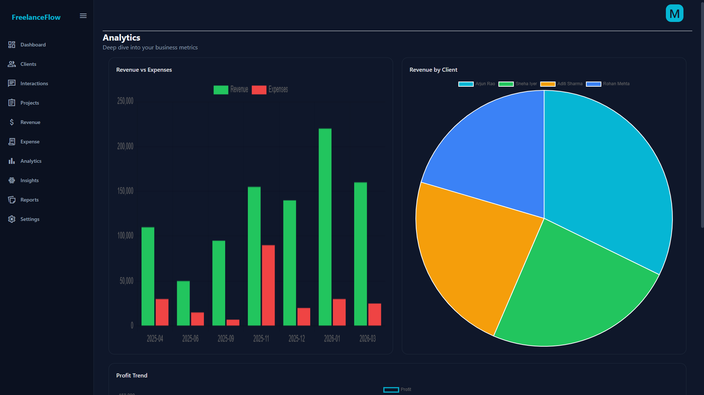

# Smart CRM Analytics System

## Overview

Smart CRM Analytics System is a Flask-based Customer Relationship Management (CRM) platform designed to help businesses manage clients, projects, interactions, expenses, and business insights in a centralized dashboard.

The system combines traditional CRM functionality with AI-powered analytics to provide meaningful business insights, project tracking, revenue analysis, and customer relationship monitoring.

---

## Features

### Client Management
- Add, update, and delete clients
- Store customer information securely
- Track customer relationships

### Project Management
- Create and manage projects
- Monitor project status
- Track project budgets and revenue
- View project performance metrics

### Interaction Tracking
- Record client meetings and communications
- Maintain complete interaction history
- Improve customer engagement monitoring

### Expense Management
- Track operational expenses
- Categorize business spending
- Monitor profit and cost trends

### Analytics Dashboard
- Revenue analysis
- Expense analysis
- Client growth tracking
- Project performance visualization
- Business KPI monitoring

### AI-Powered Insights
- Generate business summaries using Google Gemini
- Analyze CRM data automatically
- Provide actionable recommendations

### Authentication System
- User registration and login
- Session management
- User-specific data access

---

## Tech Stack

### Backend
- Python
- Flask
- SQLAlchemy

### Database
- MySQL

### Frontend
- HTML
- CSS
- JavaScript

### AI Integration
- Google Gemini API

### Data Analysis & Reporting
- Pandas
- Matplotlib
- ReportLab

---

## Project Structure

```text
Smart-CRM-System/
│
├── screenshots/
├── services/
├── static/
├── templates/
│
├── .env.example
├── .gitignore
├── LICENSE
├── README.md
├── app.py
├── models.py
└── requirements.txt
```

---

## Installation

### 1. Clone Repository

```bash
git clone https://github.com/yourusername/Smart-CRM-System.git

cd Smart-CRM-System
```

### 2. Create Virtual Environment

```bash
python -m venv venv
```

### 3. Activate Virtual Environment

**Windows**

```bash
venv\Scripts\activate
```

**Linux / macOS**

```bash
source venv/bin/activate
```

### 4. Install Dependencies

```bash
pip install -r requirements.txt
```

### 5. Configure Environment Variables

Create a `.env` file in the project root directory:

```env
SECRET_KEY=your_secret_key

DATABASE_URL=mysql+pymysql://root@localhost/smart_crm_system

GEMINI_API_KEY=your_gemini_api_key
```

### 6. Create Database

```sql
CREATE DATABASE smart_crm_system;
```

### 7. Run Application

```bash
python app.py
```

Open:

```text
http://127.0.0.1:5000
```

---

## Screenshots

### Dashboard



### Client Management



### Project Management



### Analytics Dashboard



---

## Future Improvements

- Customer Churn Prediction using Machine Learning
- Revenue Forecasting
- AI-based Customer Segmentation
- Email Automation
- Role-Based Access Control
- AWS Cloud Deployment
- Advanced Business Intelligence Reports

---

## Learning Outcomes

This project helped me gain practical experience in:

- Full Stack Web Development
- Database Design and Management
- Flask Application Development
- Data Analytics and Visualization
- AI Integration using LLM APIs
- Business Intelligence Dashboards
- Git and GitHub Workflow

---

## License

This project is licensed under the MIT License.

---

## Author

**Manthan**

GitHub: https://github.com/Manthan-Lathiya

LinkedIn: https://www.linkedin.com/in/manthan-lathiya/
